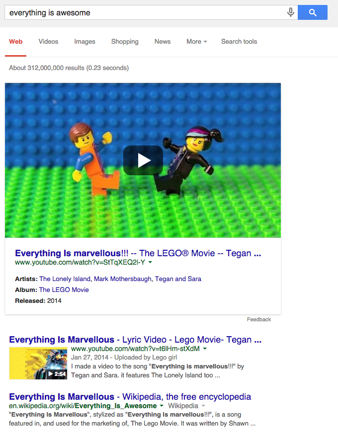

# That's Marvellous

A [Chrome extension](https://github.com/blech/thats-marvellous/blob/master/thats-marvellous.crx?raw=true) that replaces occurrences of the A word (not that one, the one that's overused by Californians to describe things that are good) with a much better old-fashioned synonym. Look, maybe a picture would help:

[Direct download of crx file](https://github.com/blech/thats-marvellous/blob/master/thats-marvellous.crx?raw=true)

## Installation

In Chrome, choose Window > Extensions.  Drag thats-marvellous.crx into the page that appears.

## TODO

The extension prefers British to American English. I should make that optional.

### Thanks

If I hadn't had [cloud-to-clown](https://github.com/apage43/cloud-to-clown) to crib from this probably wouldn't have happened.